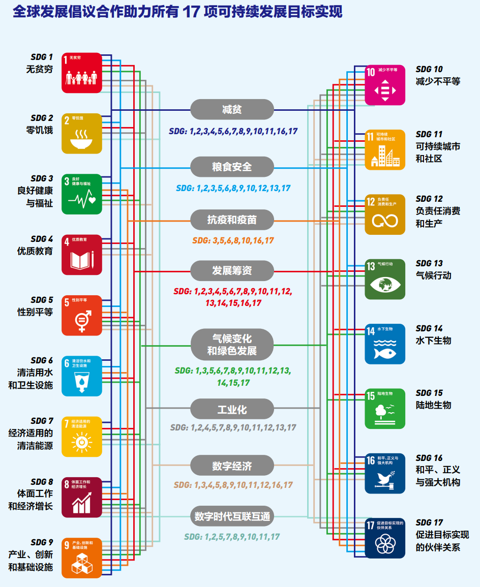
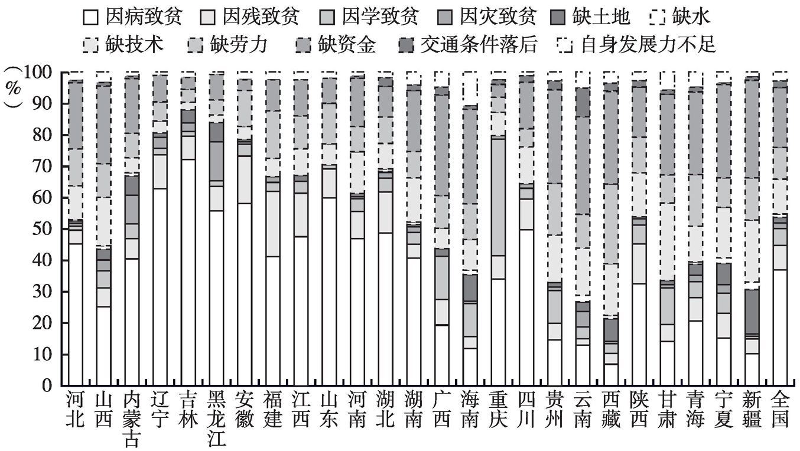
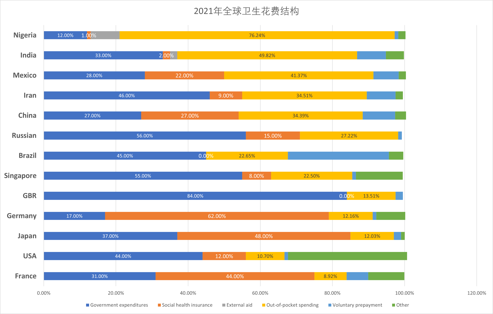
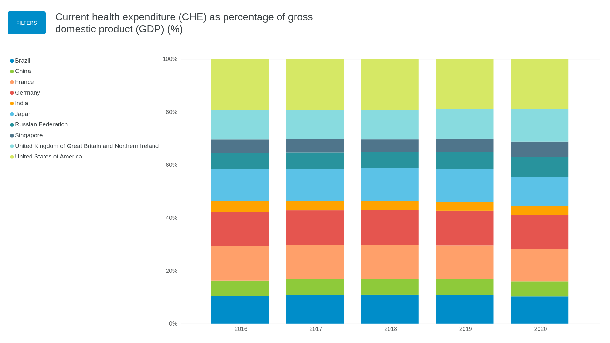

[以自由看待发展, 阿马蒂亚·森02](https://book.douban.com/subject/1084434/)

# 健康、疾病与可持续发展
> 协调三大核心要素：经济增长、社会包容和环境保护。这些因素是相互关联的，且对个人和社会的福祉都至关重要。

[World Health Statistics 2023](https://www.who.int/data/stories/world-health-statistics-2023-a-visual-summary/)  

[发展的新时代, 2023年度报告, 世界银行]()

[2023全球实现可持续发展目标进展情况](https://unstats.un.org/sdgs/files/report/2023/secretary-general-sdg-report-2023--ZN.pdf?_gl=1*kf4whh*_ga*ODk4OTIyODMxLjE3MTUxMzI5NDc.*_ga_TK9BQL5X7Z*MTcxNTE0NjY1NS4zLjEuMTcxNTE0NzIwMS4wLjAuMA..)  
现在是 2030 年征程的中点，这份特别版报告对照全球可持续发展目标指标框架，介绍 2015 年以来所取得进展的最新情况。  

在通往 2030 年的道路中点，可持续发展目标陷入了困境。对已有数据的大约 140 个具体目标的初步评估表明，只有大约 12%的目标正在实现；超过一半的目标虽然取得了一些进展，但略微或严重偏离轨道；约 30%的目标要么没有变化，要么倒退到 2015 年基线以下。

极端贫困的人的目前定义是，按 2017 年购买力平价计算，每人每天生活费低于 2.15 美元的人。

[中国落实2030年可持续发展议程进展报告（2023）](https://www.mfa.gov.cn/web/ziliao_674904/zt_674979/dnzt_674981/qtzt/2030kcxfzyc_686343/zw/202310/P020231018366004072326.pdf)  

[2023全球发展倡议落实进展报告](https://www.cikd.org/detail?docId=1760539718823579649)  

可持续发展目标呼吁全世界共同采取行动，消除贫困、保护地球、改善所有人的生活和未来。17项目标于2015年由联合国所有会员国一致通过，作为2030年可持续发展议程的组成部分。该议程为世界各国在15年内实现17项目标指明了方向。

# 减贫

[贫困与饥荒, 阿马蒂亚·森2001](https://book.douban.com/subject/1340525/)

[党的十八大以来经济社会发展成就系列报告：脱贫攻坚战取得全面胜利 脱贫地区农民生活持续改善](https://www.gov.cn/xinwen/2022-10/11/content_5717712.htm)  
中国对全球减贫贡献率超过七成。改革开放以来，按照世界银行每人每天1.9美元的国际贫困标准，我国减贫人口占同期全球减贫人口70%以上；据世界银行公开数据，我国贫困发生率从1981年末的88.3%下降至2016年末的0.5%，累计下降了87.8个百分点，年均下降2.5个百分点，同期全球贫困发生率从42.7%下降到9.7%，累计下降33.0个百分点，年均下降0.9个百分点，我国减贫速度明显快于全球，贫困发生率也大大低于全球平均水平。

2020年贫困地区农村居民人均可支配收入12588元，2013—2020年年均增长11.6%，比全国农村年均增速快2.3个百分点；扣除价格因素，**年均实际增长9.2%**，比全国农村年均实际增速快2.2个百分点。

2020年，贫困地区农村居民人均消费支出达到10758元，2013—2020年年均增长10.9%，扣除价格因素，**年均实际增长8.6%**。2020年，贫困地区农村居民人均消费支出是全国农村平均水平的78.5%，比2012年提高了8.0个百分点。分结构看，吃、穿等基本生活消费支出占比缩小，恩格尔系数进一步下降。**2020年，贫困地区农村居民人均食品烟酒支出为3632元，2014—2020年年均增长8.4%，占消费支出比重（恩格尔系数）为33.8%，**

[《人类减贫的中国实践》白皮书](https://www.gov.cn/zhengce/2021-04/06/content_5597952.htm)

[国家乡村振兴局正式挂牌](http://www.xinhuanet.com/politics/2021-02/25/c_1127139087.htm)  
2021年2月25日16时，北京市朝阳区太阳宫北街1号，国家乡村振兴局牌子正式挂出。“国务院扶贫开发领导小组办公室”牌子此前已经摘下。

## 致贫原因

[人类减贫史上的中国奇迹-中国扶贫改革40周年论文集](https://www.ncepu.edu.cn/docs/2020-04/b216fce50d0e4f46bf6133c6109b9b14.pdf)  
统计显示，中国的贫困人口中因病致贫、因病返贫的比率 2016 年为 44%，“全国 30 个省、市、自治区调查了 3000多户，1 万多人，接近上百个村，许多村因病致贫、因病返贫的比例有的达到60%、80%”；此外，因灾致贫、返贫也占很大比例，这都属于典型的能力缺失致贫。

[精准扶贫理念路径再精准](http://www.xinhuanet.com//politics/2016-06/13/c_129055964.htm)  
分类把握致贫原因。据中央农办统计，目前建档立卡贫困户中致贫原因占比由高到低排序依次为，因病致贫占42.2%，因缺资金致贫占35.4%，因缺技术致贫占22.3%，因缺劳动力致贫占16.8%，因学致贫占9.0%，因残疾致贫占5.8%。

有些贫困户存在多个致贫因素。其中，缺知识、缺资金、缺技术等致贫的贫困户占比为66.7%，可以通过帮扶措施阻断相关因素，应做到能扶必扶；因疾病、残疾、缺劳力等问题致贫的贫困户占比为64.8%，致贫因素只能缓解而无法彻底解决，需要社会政策兜底应保尽保。各地在扶贫攻坚实践中，必须对此做到“心中有数”。

## 绝对贫困、防止返贫
[国家精准扶贫评估理论体系及其实践应用](http://old2022.bulletin.cas.cn/publish_article/2020/10/20201008.htm#b5)  

新时代实施的精准扶贫内在地包含了精准管理、精准考核，以强化社会监督、公众参与，进而全面提升精准扶贫工作成效。第三方评估通过引入独立于政府部门之外的专业组织开展政府绩效考核，弥补了政府内部自我评估的缺陷，提升了政府绩效评估的客观性和公正性。

[《中国农村扶贫开发纲要（2011－2020年）》](https://www.gov.cn/gongbao/content/2011/content_2020905.htm)

[中共中央 国务院关于打赢脱贫攻坚战的决定, 2015](https://www.gov.cn/xinwen/2015-12/07/content_5020963.htm)
到2020年，稳定实现农村贫困人口不愁吃、不愁穿，义务教育、基本医疗和住房安全有保障。实现贫困地区农民人均可支配收入增长幅度高于全国平均水平，基本公共服务主要领域指标接近全国平均水平。确保我国现行标准下农村贫困人口实现脱贫，贫困县全部摘帽，解决区域性整体贫困。

[历史性的跨越 新奋斗的起点——习近平总书记关于打赢脱贫攻坚战重要论述综述](http://www.xinhuanet.com/politics/leaders/2021-02/24/c_1127131147.htm)  
中国脱贫攻坚战取得了全面胜利，现行标准下9899万农村贫困人口全部脱贫，832个贫困县全部摘帽，12.8万个贫困村全部出列，区域性整体贫困得到解决。

[中国扶贫开发年鉴2021中文版](https://yearbook.iprcc.org.cn/download/2021nj_ch/%E4%B8%AD%E5%9B%BD%E6%89%B6%E8%B4%AB%E5%BC%80%E5%8F%91%E5%B9%B4%E9%89%B4)

[消除绝对贫困, 中国的实践](https://www.mfa.gov.cn/web/ziliao_674904/zt_674979/dnzt_674981/qtzt/2030kcxfzyc_686343/zw/202009/P020210929391428609630.pdf)

[2020年中国农村贫困监测报告](https://www.baogaoting.com/info/42233)

[家精准扶贫评估理论体系及其实践应用](https://dds.sciengine.com/cfs/files/pdfs/1000-3045/7EA2F7477CFD4C5DBCBE5085D526EE9D.pdf)  

[精准扶贫背景下贫困人口持续脱贫问题研究-基于新疆维吾尔自治区乌恰县的分析](http://www.cjarrp.com/ch/reader/download_pdf_file.aspx?journal_id=zgnyzyyqh&file_name=A8D77C701D04C8817E55F1432BF6DE6DB34590057662B685F44685B57E3F5877757D71751D473BF77ECD2D664C1B4FAEC16B0CBF3009036D6C1B048C377B21FF&open_type=self&file_no=20190927)

[中国减贫四十年：驱动力量、借鉴意义和未来政策方向](https://thedocs.worldbank.org/en/doc/f692402b5b3b21154f103ee64c0c551d-0070012022/original/Poverty-Synthesis-Report-cn.pdf)

[新中国成立后70年的反贫困历程及减贫机制](https://zgncjj.ajcass.com/magazine/show?id=70123&jumpnotice=201606270007)

[中国与世界银行贫困标准的比较](https://www.cikd.org/detail?docId=1586)  

改革开放以来，中国政府先后制订了3次贫困标准。

从单个时间节点看，长期以来，中国贫困线低于世界银行极端贫困线。中国设定更低的贫困标准是基于当时中国经济社会发展水平的现实考量，把扶贫开发的基本目标和中心任务放在主要解决农村贫困人口的温饱问题上，从最紧迫的问题入手，量力而行，确保重点，分阶段推进。

2010年中国设定的贫困线经世行专家和中方专家按照世行CPI项目的2011年PPP购买力平价测算，**折合2.3美元/人/日的贫困标准**。在这一货币标准下，贫困标准户的实际消费已经达到稳定温饱水平。同时，国家又提出保障义务教育、基本医疗和住房等非货币标准实施脱贫政策。货币与非货币标准的结合折算出的消费水平与世界银行的高贫困线对应的“稳定温饱”相一致，实际上已经超过了世界银行定义的每天1.9美元的极端贫困标准，甚至**更接近中等收入国家每天3.2美元的贫困标准**。

2015年，世界银行根据2010年购买力平价再次用上述15个国家的贫困线通过购买力平价测算出均值，得出新的国际贫困标准，即每人每天1.9美元。

[《四川省健全防止返贫动态监测和帮扶机制办法(试行)》](http://www.cdjinjiang.gov.cn/jjq/c168371/2023-11/09/content_9da9288f7e824361a4fea122b8976ee5.shtml)  
以脱贫攻坚期国家扶贫标准的1.5 倍作为我省2021 年监测范围（家庭年人均纯收入6000 元）。过渡期内（2021—2025 年）综合四川省物价指数变化、农村居民人均可支配收入增幅和农村低保标准，适时进行调整。农村低保标准高于省监测范围的市（州），可将监测范围调至农村低保标准。

坚持全面覆盖、重点核查。采取集中排查、自主申报、日常摸排、部门预警、关联监测等方式，全面收集风险线索，对存在疑似返贫致贫风险的农户进行重点核查，确保不漏一户一人。

[精准扶贫绩效的第三方评估：理论溯源、 作用机理与优化路径](https://xkgc-data.obs.cn-north-1.myhuaweicloud.com/xiaokang/5/5/7221615245700.pdf)  

## 相对贫困

## 健康疾病负担
> “救护车一响，一年猪白养；住上一次院，三年活白干；十年努力奔小康，一场大病全泡汤。”这是对大病突袭一个家庭后的形象描述。

[全球健康疾病负担，GBD](https://www.healthdata.org/research-analysis/gbd)

https://www.who.int/data/gho/data/themes/mortality-and-global-health-estimates/global-health-estimates-leading-causes-of-dalys

[1990—2019年中国疾病负担趋势分析]()
DALY=YLD+YLL，The DALY estimates how much disease affects (‘burdens’) the life of the population. It is the primary metric used by the World Health Organization to assess the global burden of disease. 

  
非传染病非传染性疾病导致的DALY在全部疾病负担中占比最高，由1990年的60.62%升至2019年的84.93%，而传染病、母婴疾病和营养性疾病及伤害占比则大幅下降。  

  
55岁开始，DALY增加较多，心血管疾病、慢性呼吸道占比显著增加。  

  
2019 年，造成全球与中国 DALY 损失排名前 10 疾病中有 6 大病因相同，包括中风、缺血性心脏病、慢性阻塞性肺疾病、道路交通伤害、
腰痛和糖尿病。

  
听力损失、腰痛、偏头痛、抑郁症已经成为YLD四大病因。越来越多的工作年龄人口将大部分时间花在办公环境中，缺乏锻炼，导致腰背和颈部相关疾病的发病率增加。

  
部分与饮食相关的风险增加，特别是高体重指数。心血管疾病的驱动因素如高收缩压、胆固醇、空腹血糖和饮食不良等风险普遍存在，随着人口老龄化，这一持续负担可能扩大。在不断扩大的中国医疗体系中，针对慢性病（尤其是老年人）的措施应优先考虑。

  

|   |总体| 男性  |女性|
|---|---|---|---|
| 10-24岁  |   |前 10 原因中有 4 个是伤害导致（道路交通伤害、溺水、自我伤害和跌落）  |而偏头痛、两种精神障碍（抑郁和焦虑）、腰痛 |
| 25-49岁  |   |道路交通伤害 |妇科疾病 |
| 50~74 岁  | 较 1990 年增加 53.33%  |癌症 |其他肌肉骨骼疾病、抑郁症、关节炎和肺癌 |

[中国已经发生健康贫困的女性化了吗?, 2022](http://www.swg.zju.edu.cn/_upload/article/files/bc/33/c4c1ef5d4cd2baf6996578835499/9f8a9420-39a8-4458-ae2f-8e28a7af606d.pdf)  
广义健康贫困女性化不仅包含狭义健康贫困女性化的测量内容，还有医疗卫生服务利用个体性别差异、家庭户主性别差异。

从个体和家庭户主的性别占比看，健康贫困女性化并未在中国发生; **从家庭户角度考察的卫生服务资源剥夺情况表现出“女户主化”的趋势**。无论是三大慢病还是大病，女户主的就诊次数均少于男配偶，但其 3 年连续就诊率较高。

尝试分析原因是相对较低的社会经济地位和为家“牺牲”的利他主义观念成为阻碍女户主充分利用医疗服务资源的重要因素。

## 卫生健康经济

[2022年我国卫生健康事业发展统计公报]()  
[2022年中国卫生总费用核算结果与分析](https://awsdownload.cqvip.com/downloadpaper/api/v1/pdf/stream/2024/7111310051?infos=QUZBQkFFRkNGQkZBQUVBREJLQUJBREFHQUtCTUFFQUhBT0ZIQk1BSkZIQUZBREJOQUVBRUFDRkhGQ0ZERkVBSEFPQUpGQ0FCQk1BREFBQUNBREJPQUdBQUFDQUFBREFCQUhBQkFFQUFCTUFFQUZBQkJJQUFCT0FCQk1CT0FDQUFBRkFGQk1BQkFHQk1BQkFBQkhBQUFJQUxBQ0FDQUtBRkFCQk9GRkZDRkFGRkFGQUlBQUFKQUpGRkFFRkhBQkZEQU9BREZEQUFBSEFJRkVGREZHQURGQ0ZDRkJBQ0FBQUlBRUFKQk9BQkJNQUJCUEZERko&clientID=205cba43-0279-479f-8d43-353fabd798c0&fileName=2022%e5%b9%b4%e4%b8%ad%e5%9b%bd%e5%8d%ab%e7%94%9f%e6%80%bb%e8%b4%b9%e7%94%a8%e6%a0%b8%e7%ae%97%e7%bb%93%e6%9e%9c%e4%b8%8e%e5%88%86%e6%9e%90.pdf&algorithm=0) 

- 卫生费用筹资结构优化

经常性卫生费用是指当年**实际使用的医疗卫生服务与产品的全部消费金额，更能反映居民医疗卫生服务费用负担情况**。本研究考虑数据完整性和可比性，以2020年数据为主，分析我国经常性卫生总费用发展趋势。2020年经常性卫生费用占总费用的79.49%。  

**2022年人均卫生总费用为6044.09元（898.60美元）**，比2021年增加604.13元。2022年我国个人卫生支出占比已降到27%以下（**算下来个人年支出6044.09*0.2689=1625.3元，占城镇居民人均可支配收入1625.3/45123=3.6%**），但从消除发生家庭灾难性卫生支出的国际经验看仍有一定空间（上限值20%）。个人卫生支出占比明显高于OECD国家平均水平。（**个人卫生支出费用不高，但是占筹资结构比例高，相较于发达国家**）。  

https://apps.who.int/nha/database/country_profile/Index/en  

- 按费用去向的供能构成

2020年人均经常性费用是4062.65元，门诊花费4062.65*0.2785=1131.45元，住院花费4062.65*0.4489=1823.72元。  

  
2022年，全国医疗卫生机构总就诊人次84.2亿，较2021年有极小幅度下滑，基本与2021年持平。居民平均就诊6.0次。

- 政府财政力度
2015—2022年，我国政府卫生支出年均增长7.12%，远高于GDP（5.72%）和财政支出（3.18%）的年均增速，占GDP比重由1.81%增至1.99%，**占财政支出比重由7.09%增至9.22%**。反映出在国民经济下行压力较大的背景下，政府卫生投入力度仍在持续加大，特别是2020年，政府卫生支出增速从2019年的8.47%跳增至21.19%。
同期，一般公共预算卫生健康支出（210科目）中对医疗卫生机构的投入从2015年的52.01%下降到2019年的49.63%，2022年回升到58.22%；对医保的投入（即需方投入）从2015年的47.99%上升到2019年的50.37%，2022年回落到41.78%。可见，疫情之前我国财政卫生健康支出整体体现了“兼顾供给方和需方”，且不断向需方倾斜的趋势。 

https://www.who.int/data/gho/data/indicators/indicator-details/GHO/current-health-expenditure-(che)-as-percentage-of-gross-domestic-product-(gdp)-(-)

- 国际比较
根据WHO最新统计数据，2015—2021年，在成员国中，我国卫生总费用占GDP比重降序排位由102位上升至90位，人均卫生总费用由81位上升至69位。

- 问题
从机构配置看，近几年基层医疗卫生机构卫生费用增速较低，占比呈下降趋势，这是长期以来卫生健康供给侧结构性矛盾在卫生费用上的体现。因此，建议持续优化卫生资金配置，投入重点由“以治病为中心”向“以人民健康为中心”，由“重医轻防、防治脱节”向“医防融合、防治并重”转变，有效解决卫生健康事业发展不平衡不充分的问题。

- 解决方案
根据不同人群健康风险实施针对性的健康干预措施，调整投入结构，落实疾病早防早治；基于病种费用和干预措施的成本效果分析，确定慢性病控制的优先领域。

[2023年居民收入和消费支出情况](https://www.stats.gov.cn/sj/zxfb/202401/t20240116_1946622.html)  

2023年，全国居民人均可支配收入39218元，比上年名义增长6.3%，扣除价格因素，实际增长6.1%。分城乡看，城镇居民人均可支配收入51821元，增长（以下如无特别说明，均为同比名义增长）5.1%。  
2023年，全国居民人均消费支出26796元，比上年名义增长9.2%，扣除价格因素影响，实际增长9.0%。分城乡看，城镇居民人均消费支出32994元，增长8.6%。  

[我国医保体系研究——支付方为核心](https://pdf.dfcfw.com/pdf/H3_AP202207281576653276_1.pdf)

[上海市2018年经常性卫生费用核算结果分析](https://html.rhhz.net/ZGWSZY/html/2022-4-447.htm#top)  

[Universal health coverage in China: a serial national crosssectional study of surveys from 2003 to 2018](https://www.thelancet.com/action/showPdf?pii=S2468-2667%2822%2900251-1)  

[灾难性自付医疗支出与贫困](https://qks.sufe.edu.cn/J/PDFFull/9f03be49-b3ee-4e02-831a-00a8d43003b5.pdf)  

[欧洲（德、英、法）社会医疗保险体系分析](https://zhuanlan.zhihu.com/p/219924119)  

[中国医院究竟向患者收了多少钱？](https://www.cn-healthcare.com/api/third/article/499621)  

# 人口

[中国健康老龄化之路：北京大学-柳叶刀重大报告](https://nsd.pku.edu.cn/cbw/yjbgxl/528112.htm)  
2020年到2050年的三十年间，我国人口形势会发生很大变化。60岁以下所有年龄段人群的数量都会净减少，二三十岁年龄段人口会减少30-40%，60岁以上人口数量将有较大涨幅，特别是高龄老人，即80岁以上人口数量上涨幅度最快。

2020年到2050年的三十年间，我国人口形势会发生很大变化。60岁以下所有年龄段人群的数量都会净减少，二三十岁年龄段人口会减少30-40%，60岁以上人口数量将有较大涨幅，特别是高龄老人，即80岁以上人口数量上涨幅度最快。