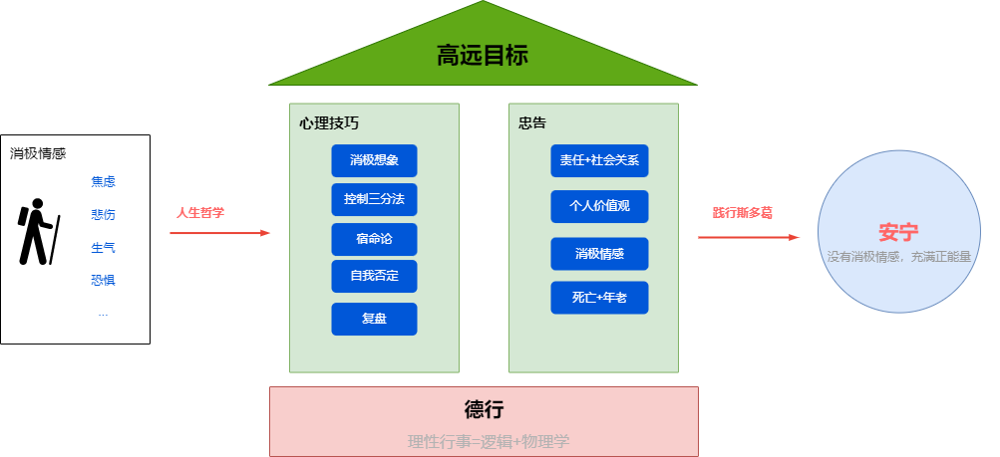

[Healthy Living Guide 2020/2021, Harvard T.H.CHAN](https://www.hsph.harvard.edu/nutritionsource/2021/01/19/healthy-living-guide-2020-2021/)

[程序员延寿指南](https://github.com/geekan/HowToLiveLonger)  
收集所有已证明，显著影响ACM的活动。（具有实际意义）    

[程序员防猝死指南](https://www.cnblogs.com/anding/p/16482341.html)  
主要是围绕健身周围的一系列知识和实用的活动指南。  

# 压力管理

[哈佛幸福课]()  
人们很容易忽略一些明显的问题。  
积极心理学的本质就是健康本源。
健康模型更注重培养能力，而不只是改正错误。  
心理学关注的不仅仅是疾病和健康，还包括工作、教育、洞察力、爱、成长和玩乐。  

[生命安宁](https://book.douban.com/subject/24732489/)  

斯多葛主义总体的思路就是通过建立高远的目标，利用心理技巧和正确的人生哲学，最终得到安宁的生活。  
  
为了抑制享乐适应，需要间歇性地想象坏事发生。（跳出舒适区）  
把事情分类成完全控制、部分控制、无法控制，内化目标。
把事情分类成过去、现在和未来，现在和过去无法改变，着眼未来。  
生活得好像坏事已经发生。（自律）  

# 心理学、养育、教育
[心理学导论，mitterer07](https://book.douban.com/subject/2125973/)  

[伯克毕生发展心理学, berk2014](https://book.douban.com/subject/25773343/)  
更好的看待和养育孩子。  
结合论文，详细介绍了人的一生每个重要阶段生理和心理的发展情况。  
儿童从出生到青年，身体发育、自我理解、语言发展、情绪管理。  
家庭教养方式、社会大环境的影响。

[伍尔福克教育心理学, woolfolk2015](https://book.douban.com/subject/26744183/)  

[这才是心理学，2020](https://book.douban.com/subject/35023259/)  

[The Challenge](https://book.douban.com/subject/26304087/)

# 社会

[How to Win Friends & Influence People](https://www.amazon.com/exec/obidos/ASIN/0671027034/enterpriseint-20)

[亲密关系](https://book.douban.com/subject/26585065/)

[社会心理学](https://book.douban.com/subject/1476651/)

# 理财
[小狗钱钱, 舍费尔09](https://book.douban.com/subject/3576486/)

[财富自由之路](https://book.douban.com/subject/27094706/)

[巴菲特致股东的信](https://book.douban.com/subject/30164963/)

[穷查理宝典](https://book.douban.com/subject/4208757/)

[投资者的未来](https://book.douban.com/subject/30313572/)

[穷爸爸、富爸爸](https://book.douban.com/subject/1033778/)

# 运动、饮食与健康
> 吃的健康、有规律的锻炼、维持体重、限制酒精、不抽烟

[运动生理学，wilmore11](https://book.douban.com/subject/7058979/)

[量化健身：原理解析, 陈柏龄2019](https://book.douban.com/subject/34912103/)  

体重=骨骼+水分+肌肉+脂肪  

人体供能顺序：糖类->脂肪->蛋白质  

| 目标  | 合成原理 | 代谢本质 | 训练方式|
|---|---|---|---|
|脂肪   | 食物脂肪+碳水化合物+蛋白质 |热量赤字+持续，提高肾上腺素、降低胰岛素，控制分解速度    |训练强度低、容量较高、组间休息时间短。力量+有氧运动。  
|肌肉   |肌肉围度增大包括慢肌（纤维加粗的健美型）和快肌（纤维增多的力量型）。|运动前后热量盈余+蛋白+训练压力    |阻力对抗训练->肌肉肥大，4~6组，高强度，三分钟间歇。|
  
> 先力量训练（自由核心训练+固定器械）、再做有氧训练（跑步）。  
> 地中海式饮食=高质量低脂+灵活大体积碳水  

| 营养  | 摄入量  |推荐|
|---|---|---|
|蛋白   | 10个鸡蛋=2升牛奶=半斤鸡肉  |廋肉1两+1个鸡蛋+鱼1两+半两大豆+半斤牛奶 |
|碳水   | 80克米饭（玉米、豆子、土豆、红薯）+少量水果/餐  |不能一味追求低GI  |

[健身营养全书](https://book.douban.com/subject/30157798/)  

[中国居民膳食指南]()

每天有200g的蛋白质被转化。 
中低强度的耐力训练消耗更多的脂肪酸供能。  
各国营养学会基本上都推荐50-10-30（碳水-蛋白质-脂肪）的饮食结构。 

# 哲学、人生

[想透彻, 阿皮亚2017](https://book.douban.com/subject/27167590/)

[给青年的十二封信, 朱光潜2014](https://book.douban.com/subject/26253561/)

[高效能人士的七个习惯, 柯维](https://book.douban.com/subject/30422818/)

[成长，谢耘10](https://book.douban.com/subject/4812990/)

[曾国藩家书](https://book.douban.com/subject/26826152/)

[大问题, 所罗门2018](https://book.douban.com/subject/30176572/)