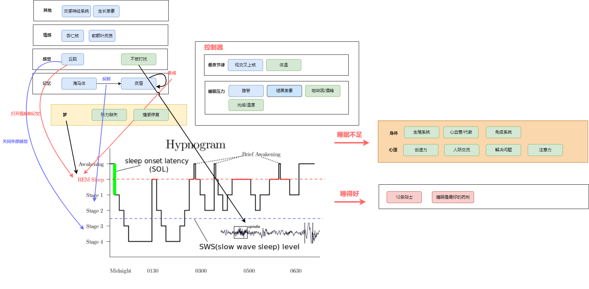
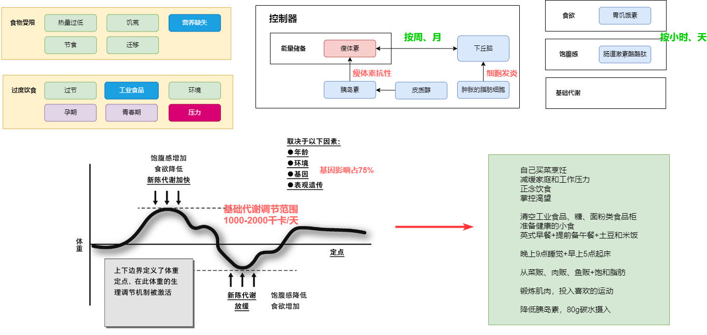
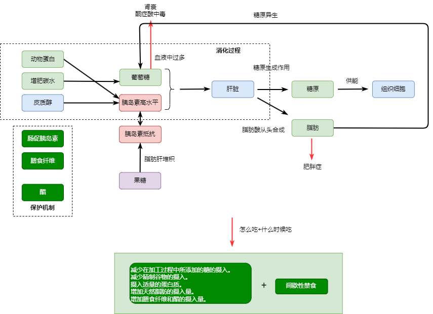

# 人类文明、现代体育

[Physical Fitness History](https://www.lovetoknowhealth.com/fitness/physical-fitness-history)  
孔子最早在六艺中提及射和御，奠定了价值观，从而有了功夫、摔跤和羽毛球的发展。  

古希腊通过艺术和军事的推动体形，在整个欧洲发展了体操。  

工业革命带来的生活方式的改变，造成了飙升的心脏病和糖尿病发病率，引起了政府和军队的注意，在健身房进行的健身行业的爆炸式发展，但这不是人类文明的初心。  

[健康中国2030”规划纲要](https://www.gov.cn/zhengce/2016-10/25/content_5124174.htm)  
推进健康中国建设，是全面建成小康社会、基本实现社会主义现代化的重要基础，是全面提升中华民族健康素质、实现人民健康与经济社会协调发展的国家战略，是积极参与全球健康治理、履行2030年可持续发展议程国际承诺的重大举措

[健康中国行动（2019—2030年）](http://www.nhc.gov.cn/guihuaxxs/s3585u/201907/e9275fb95d5b4295be8308415d4cd1b2.shtml)  
规定了角色、重大指标、活动

[树立健康新理念 建立健康生活方式](https://www.ggj.gov.cn/zgjghq/2012/201206/201206/t20120612_19265.htm)  
针对现代健康定义做出解释

[国民体质测定标准（2023年修订）](https://www.sport.gov.cn/n315/n20001395/c25880704/part/25880716.pdf)  
新标准针对当前我国幼儿、成年人和老年人需要提升平衡能力、心肺功能、肌肉力量等现实需求。  
体质水平=身体形态15%+机能25%+素质60%  

[国民体质监测公报](https://www.gov.cn/guoqing/2023-03/12/content_5745851.htm)  
中国政府每5年发布一次国家国民体质监测公报，系统分析了国民体质的基本情况、特征和变化规律。  

[2022 年中国居民健康素养监测情况](https://www.gov.cn/lianbo/bumen/202308/P020230822019124684406.pdf)

[Healthy Living Guide 2020/2021, Harvard T.H.CHAN](https://www.hsph.harvard.edu/nutritionsource/2021/01/19/healthy-living-guide-2020-2021/)

[程序员延寿指南](https://github.com/geekan/HowToLiveLonger)  
收集所有已证明，显著影响ACM的活动。（具有实际意义）    

[程序员防猝死指南](https://www.cnblogs.com/anding/p/16482341.html)  
主要是围绕健身周围的一系列知识和实用的活动指南。

# 睡眠

[美国国家睡眠基金会](https://www.sleepfoundation.org/)

[Improving Sleep: A guide to a good night's rest, harvard](https://books.google.com/books?id=G8lL1ZhvZjIC&printsec=frontcover&hl=zh-CN&source=gbs_ge_summary_r&cad=0#v=onepage&q&f=false)

[YOUR GUIDE TO Healthy Sleep, nih](https://www.nhlbi.nih.gov/files/docs/public/sleep/healthy_sleep.pdf)

[Sleep resources guidebook](http://www.promoinfotools.com/Communications/ecard/Svcs/BetterSleep/SleepGuidebook_RFL.pdf)

[Nathaniel Kleitman, PhD, Kleitman99](https://www.uchicagomedicine.org/forefront/news/nathaniel-kleitman-phd-1895-1999)

Kleitman在猛犸洞里证明了一项惊人的科学发现，人类的昼夜节律大约是一天。  

[Physiology of Sleep, carley2016](https://www.ncbi.nlm.nih.gov/pmc/articles/PMC4755451/)

[我们为什么要睡觉？](https://book.douban.com/subject/35332778/)

超过65%的美国成年人在一周中没有一天晚上得到了7~9小时的建议睡眠时间。  
人类（以及所有其他物种）永远不能把我们之前失去的睡眠“睡回来”。 

一生的睡觉时间

| 阶段  | 睡觉时间  |时长|备注|
|---|---|---|---|
|出生前   |   |24, 6REM+6NREM+12|肌肉抑制系统不健全|
|幼儿   |   |11小时|逐渐双相睡眠，NREM:REM=80:20|
|9岁   |8pm入睡，9pm睡着   |10小时, 9-12||
|16岁   |11pm入睡  |9小时, 8-10 |节律器比父母晚|
|成年人   |10pm  |8小时, 7+ |
|中老年人   |8pm |8小时 |慢波质量和数量降低，记忆衰退，频繁清醒，节律器提前，但腺苷压力不足

# 健康膳食

> 吃什么和喝什么能满足营养需求，促进健康，并减少慢性疾病的风险
> 

## 食物、营养摄入

[东方健康膳食模式「Eastern healthy diet pattern」 浅析](https://zhuanlan.zhihu.com/p/569173134)

[中国食物成分表](http://www.hyyhealth.com/food)

[食品营养标签管理规范](https://www.gov.cn/gzdt/2008-01/11/content_856260.htm)  
它显示了食品的营养特性和相关营养学信息，是消费者了解食品营养组分和特征的主要途径。

[中国居民膳食指南](http://dg.cnsoc.org/article/04/x8zaxCk7QQ2wXw9UnNXJ_A.html)

【强调蔬菜+奶制品】> （水果+谷类） > 动物 > （薯+豆）  
建议(1个鸡蛋+200g牛奶)+（150g廋肉+1小团蔬菜+1小团碳水）+（1小团谷薯+1小团蔬菜+1个苹果）  

| 营养  | 摄入量  |推荐|美国标准|中国标准|国内平均
|---|---|---|---|---|---|
|蛋白   | 8个鸡蛋=4斤牛奶=半斤鸡胸肉=3个鸡腿  |廋肉1两+鱼1两+1两大豆+半斤牛奶+1个鸡蛋 |56g|70g|65g
|碳水   | 100g土豆=100g红薯=15g碳水  |不能一味追求低GI  |130g|400-600g|300g
|脂肪   | 鱼+坚果+鸡蛋  |大部分是18:2, 18:3  |20-35g|70g|80g

- 上述是31-50男性178cm, 70kg  
- 女性163cm, 57kg, 蛋白质大概摄入的0.8  
- 青少年蛋白质大概是女性的0.8，钙比成人需要更多

[中国居民膳食指南科学研究报告2021](https://www.chinanutri.cn/yyjkzxpt/yyjkkpzx/yytsg/zgjm/202103/P020210311486742870527.pdf)  
对膳食指南进行证据、观点分析和总结。  

[2023中国与全球食物政策报告](http://agfep.cau.edu.cn/art/2023/4/22/art_39031_962628.html)

[美国国家农业库-人类营养和食物安全](https://www.nal.usda.gov/human-nutrition-and-food-safety)  
上面有每种食物的成分库、营养库  
膳食指南  
各种跟食品相关的论文  

[美国居民膳食指南（2020-2025）](https://healthcare.utah.edu/sites/g/files/zrelqx136/files/media/documents/2023/Dietary_Guidelines_for_Americans_2020-2025-compressed_1.pdf)

- 提供了一份健康饮食框架。这个框架可以满足和自定义，以满足个体和不同的饮食文化。  
- 整个生命周期都按照这份健康饮食模式。  
- 关注食物组，满足高营养密度食物、饮料和热量限制。每餐都有一半是蔬菜和水果，全谷物加入谷物的一半，喝低脂的奶制品、豆制品。  
- 限制糖、饱和脂肪、盐的摄入。  

[膳食营养索参考摄入量,dri](https://www.nal.usda.gov/human-nutrition-and-food-safety/dri-calculator/results)  
根据年龄、身高、体重、活动量，估算出每天的基本能量消耗，根据每个营养素功能比例，给出估计的摄入量和食谱。  

[MyPlate](https://www.myplate.gov/)  
根据身高、体重、活动量，计算每天各种营养素的摄入量

https://dtc.ucsf.edu/

## 基础代谢、热量控制、减脂、健身营养

https://www.jirou.com/tool/reliang.php

[41%中国男人超重，只有这个省最苗条](https://36kr.com/p/2419627248689924)  
男性40-60超重呈现增长模式  
北方小麦饮食模式，碳水摄入量和能力比高  
肥胖与经济水平的相关性高  

[成人肥胖食养指南](http://www.nhc.gov.cn/cms-search/downFiles/a144741bc7a7469fbbf4a98efe614035.pdf)  
根据营养科学理论、中医理论和目前膳食相关肥胖科学研究文献证据，在专家组共同讨论、建立共识的基础上，对成人肥胖患者的日常食养提出 6 条原则和建议。

还根据不同地区，给出了一年四季、一日三餐的菜单和食谱。 

[我们为什么吃（太多）：食欲的新科学](https://book.douban.com/subject/36469148/)

我们一天24小时躺在床上，仍旧会消耗掉平日里70%的能量——通过呼吸、心跳、体温控制以及体内所有细胞的化学反应。身体的这些下意识活动所需的能量被称为“基础代谢率”(BMR)。对于理解我们自身的新陈代谢来说，认识到2/3的日常能量消耗并不受意识控制。  
尽管表面上看来，我们吃多少是由意识所掌控，但实际上，**大脑中的潜意识左右了潜在的饥饿感和进食行为**。  
与节食前相比，胃饥饿素信号全天高出24%。  
而与节食前水平相比，胃饥饿素水平（因而也代表食欲水平）保持在高位，酪酪肽水平（饱腹感）保持在低位。节食不仅没能让体重持续减轻，同时节食者的食欲信号和饱腹信号即便在他们停止节食整整一年后，仍处于混乱之中。  

家庭环境对肥胖水平的影响仅有区区10%。**因此，如果一个孩子变胖了，75%的原因是来自他自己的基因**，10%来自父母养育和家庭环境的影响。  

成年男性平均每天摄入约2500千卡能量，相当于每天1050万焦耳的能量。一天有86400秒。从中我们可以计算出普通成年男性消耗能量的比率（或功率）。人体运行所需的功率是120瓦——与点亮一个灯泡的功率相当。  

今天的青少年在离开家庭进入陌生的大学世界时，也会产生同一种应激激素。在用皮质醇药物治疗炎症时，会产生食欲激增和觅食行为（还会让人感到略微兴奋，这能解释很多新生的行为）的副作用。增加的食欲导致了体重的增加。更高的皮质醇水平由此导致体重定点的升高，这解释了大一新生经常会增重5.5千克的现象。睡眠、锻炼、音乐、按摩、跳舞和欢笑都能够帮助你降低皮质醇水平。  

[你是你吃出来的, 夏萌2017](https://book.douban.com/subject/27590675/)  
[你是你吃出来的2, 夏萌2021](https://book.douban.com/subject/35340053/)

比如血管的内皮细胞1天就会死亡；胃黏膜细胞3～5天更替一次；肺表面的细胞寿命是2～3周；皮肤最外面的角质层细胞28天左右就要换新；肝细胞能存活150天左右；心脏细胞更新速度要慢很多，大约需要20年；

我们最常见的冠心病、高血压、糖尿病、肿瘤、抑郁症、气管炎、哮喘、慢性肾病等疾病，都是由不恰当的生活方式引起的，医学工作者将这些疾病统一归类为慢性非传染性疾病，简称**慢病**。

追根究底，慢病源于各种不平衡，比如缺乏睡眠、长期吸烟、大量饮酒、不运动或者运动过量、饮食不平衡、压力太大，等等

碳水化合物每克产生4千卡能量，蛋白质每克产生4千卡能量，脂类每克产生9千卡能量。

缺乏蛋白质，所以肌肉无力，消化能力差，睡眠不好。

缺乏必需脂肪酸，所以皮肤干燥，视力很差，记忆力减退。

一般来讲
- 轻体力劳动者[注：轻体力劳动者：75%时间坐或站立，25%时间站着活动，如从事办公室工作、修理电器、售货员等。]是标准体重每千克耗能30千卡，
- 中体力劳动者[注：中体力劳动者：25%时间坐或站立，75%时间特殊职业活动，如学生日常生活、机动车驾驶员、电工、安装人员、车床操作者、从事金属切割的人员等。]35千卡，
- 重体力劳动者[注：重体力劳动者：40%时间坐或站立，60%时间特殊职业活动，如从事非机械化农业劳动，炼钢、舞蹈、体育活动、装卸、采矿等。]40千卡，
- 长期卧床的人标准体重每千克耗能25千卡。

临床上我们也不是这么绝对，比如一个轻体力劳动者，偏胖，计算能量的时候减少5千卡，为标准体重每千克耗能25千卡。

大多数营养书上三大能量比例是蛋白质为10%～15% ，脂类为20%～30% ，碳水化合物为55%～65%。

满分早餐=2个鸡蛋+200牛奶+蔬菜水果（包子+鸡蛋+果蔬汁）

按书中所需能力计算所得：

| 营养  |标准   |当前
|---|---|---|
| 体重  | 179-105=74kg  |80:arrow_up:	
| 能量  | 轻体力74*30=2220大卡  |输入1000-, 输出2157
| 碳水  | 55%*2220/4=305  |102:arrow_down:	
| 蛋白质  | 15%*2220/4=83.25 |50:arrow_down:	
| 脂肪  | 2220*20%/9=50|33:arrow_down:	

早餐：豆浆+鸡蛋（68+66=134大卡）  
午/晚餐：土豆100g+西兰花150g+1个鸡腿（69+40+120=229大卡）

input=872大卡+1个苹果（80卡）+牛奶130=1050大卡

output=250大卡步行+100健身+1807基础=2157大卡

[肥胖代码](https://book.douban.com/subject/34906442/)  
人体具有基本的**生物内稳态**特征，如果某一生理过程向一个方向变化，则身体会做出反应，将向另一个方向改变以保持原来的状态。换句话说，身体会产生耐受力。身体不在它的舒适区时，为了适应环境会出现**抵抗**。  

1焦耳的橄榄油和1焦耳的糖会发生同样的代谢反应吗？答案显然是否定的，可以发现这两种食物有很多不同。糖会升高血糖水平，并促使胰腺分泌胰岛素。  

体重减轻会引发两个重要反应。第一，身体为了节约能量，将总能量消耗立即且无限期地降低。第二，为了获得更多的食物，内分泌系统发出的饥饿信号立即且无限期地增强。  

补偿机制=运动量增加导致热量摄入增加，**剧烈运动后我们吃得更多** + 补偿机制与非运动性活动的减少有关。如果你一天都在努力工作或学习，你就不太可能在休息时再做运动。  

在肥胖症进展过程中，进食次数增加的影响力是膳食结构调整的两倍。  

[健身营养全书](https://book.douban.com/subject/30157798/)  

# 健康体魄
> 吃的健康、有规律的锻炼、维持体重、限制酒精、不抽烟
> 
> 体育健身活动可以提高人体的心肺功能、肌肉力量、柔韧、平衡和反应能力，改善身体成分，从而达到增强体质、提高健康水平的效果。

[体育强国建设纲要](https://www.gov.cn/xinwen/2019-09/02/content_5426540.htm)

[全民健身指南](https://www.sport.gov.cn/n315/n20067006/c20324479/content.html)  
综合运动能力评价 = 心肺功能40+BMI20+肌肉力量20+柔韧性10+平衡能力5+反应能力5

中等运动强度主要包括健身走、慢跑（6～8千米/小时）、骑自行车(12～16千米/小时)、登山、爬楼梯、游泳等

力量练习包括非器械力量练习和器械力量练习。非器械练习是指克服自身阻力的力量练习，包括俯卧撑、原地纵跳、仰卧起坐等；

[美国体育活动指南](https://health.gov/sites/default/files/2019-09/Physical_Activity_Guidelines_2nd_edition.pdf)  
提升健康、降低慢性病风险和提升健康相关体适能（而不是运动相关）是本指南的重点。  
几乎80%的美国成年人没有满足有氧和增肌活动关键指南，只有一半的人满足有氧活动。  
NHANES发现孩子和成年美国人有7.7个小时是久坐的。  

体适能定义是身体有足够的精力和体力进行日常事务, 而不会有过度疲倦, 并且有足够的精力享受休闲活动和应付突发事件的能力。  
体适能=心肺+骨骼肌机能+灵活性+平衡+速度。  

只要是运动了就会有健康好处。越高的运动级别，越能降低全因死亡率。有些运动，立马就可以获得好处，比如降低焦虑，血压，改善睡眠、认知功能和胰岛素灵敏度；而增加心肺健康、肌肉强度、降低抑郁症状、维持血压降低，则需要几周、几个月的运动。  

|年龄  | 体育运动  |
|---|---|
|6-17岁   |  每天要有氧运动1个小时，每周3次增肌活动。   |
|成年人   | 少坐多动，每周有氧2.5-5个小时，每周2次增肌活动。8-12次，2-3组   |
|65以上老年人   | 同上；尽可能多个不同组件结合；特别是平衡运动   |

[Lean in 15](https://www.amazon.com/Lean-15-15-Minute-Workouts-Healthy/dp/0062493663)  
作者鼓励多吃，合适的燃烧脂肪，构建更多精瘦的肌肉，从而基础代谢更有效，然后你能够愉快的吃更多的食物了。  
严格的饮食和训练计划，与美食、在家烹饪、外出享受的平衡  
**愉悦的、可持续的、批量现成的、快速的、健康营养的、在家烹饪**  
瘦身没有捷径，必须符合基本的营养和代谢原理，节食、燃脂草药、奶昔果汁代餐都不是解决方案  
**使我们发胖，是因为吃得过多，超过我们身体所需，而不是碳水本身**  
黄油和椰子油等饱和脂肪用来高温炒菜，而不是加工过的多不饱和植物油  
真实的食物、水合作用、HIIT，脂肪燃烧

训练日吃2顿低碳+1顿训练后碳水加油餐+上下午零食，休息日3顿都只能吃低碳餐+上下午零食  
健身后，加1次补充餐（蜂蜜+蛋白粉），快速抵达重建肌肉纤维  
每周有氧和抗阻HIIT交替2次+额外1次，每周增加0.3m/h跑步机，2斤哑铃

[更壮 更瘦 更强](https://book.douban.com/subject/27107200/)  
逐步增加重量，正确饮食，让身体得到充分的休息。  

[运动生理学，wilmore11](https://book.douban.com/subject/7058979/)

[量化健身：原理解析, 陈柏龄2019](https://book.douban.com/subject/34912103/)  
体重=骨骼+水分+肌肉+脂肪  

人体供能顺序：糖类->脂肪->蛋白质  

| 目标  | 合成原理 | 代谢本质 | 训练方式|
|---|---|---|---|
|脂肪   | 食物脂肪+碳水化合物+蛋白质 |热量赤字+持续，提高肾上腺素、降低胰岛素，控制分解速度    |训练强度低、容量较高、组间休息时间短。力量+有氧运动。  
|肌肉   |肌肉围度增大包括慢肌（纤维加粗的健美型）和快肌（纤维增多的力量型）。|运动前后热量盈余+蛋白+训练压力    |阻力对抗训练->肌肉肥大，4~6组，高强度，三分钟间歇。|
  
> 先力量训练（自由核心训练+固定器械）、再做有氧训练（跑步）。  
> 地中海式饮食=高质量低脂+灵活大体积碳水  

## 肌肉、增肌

https://hacker1356.wordpress.com/2020/12/27/%E5%B8%B8%E7%94%A8%E5%81%A5%E8%BA%AB%E8%82%8C%E8%82%89%E8%A7%A3%E5%89%96/

[How to Gain Muscle, No Matter Who You Are](https://www.healthline.com/health/fitness/how-to-gain-muscle#training-tips)  
1-5次=锻炼更多力量，6-12次=促进肌肉生长，12-20=增强肌肉耐力

[Muscle hypertrophy and muscle strength: dependent or independent variables? A provocative review](https://www.ncbi.nlm.nih.gov/pmc/articles/PMC7582410/)

Maximizing Muscle Hypertrophy: A Systematic Review of Advanced Resistance Training Techniques and Methods

[Why exercise builds muscles: titin mechanosensing controls skeletal muscle growth under load](https://www.sciencedirect.com/science/article/pii/S0006349521006093)  

[更壮 更瘦 更强](https://book.douban.com/subject/27107200/)  
通过举重，你实际上在肌肉纤维中造成了微小的撕裂(被称为“微撕裂”)，然后身体会修复这些撕裂，使肌肉更好地处理造成损伤的刺激。这就是肌肉生长的过程(科学上称为肥厚)。

## 重量、频率强度、训练计划

[居家健身不能少了运动处方](https://www.sport.gov.cn/n20001280/n20001265/n20066978/c24905714/content.html)  
**运动中最佳心率**：110至130次，低于此心率范围不能达到锻炼目的，高于此范围则有可能诱发意外情况发生或者给身体造成损伤。

**运动频率**： 每周3次，每次运动时间为50分钟。

运动阶段分为热身运动、逐渐加量、整理恢复三部分：

热身运动可以慢走、拉伸、活动各个关节，此时身体开始出汗，身体的运动兴奋性提高，时间为5分钟。

逐渐加量需要进行40分钟运动，该阶段逐步增加运动强度达到最佳心率范围，持续30分钟。

整理恢复时，四肢进行韧带拉伸伴深呼吸，恢复至平静状态，时间为5分钟。

[How To Build Muscle, According To Experts](https://www.forbes.com/health/fitness/how-to-build-muscle/)  
首先，要记住引发肥大的三个主要因素:机械张力、肌肉损伤和代谢反应。  

**评估你的1RM重量**。完成多组（新手2-3组），每组6-12次，每次65%-85% 1RM，组间休息<60秒，最大限度提升睾酮和生长激素。

**重新调整训练容量**。随着肌肉能力的增强，同样的阻力无法带来更多的肌肉组织破坏，个把月要重新评估1RM重量。  

补充蛋白质1.2-2.0g/kg。

[How To Set Up A 7-Day Workout Schedule, According to Experts](https://www.forbes.com/health/fitness/workout-schedule/)  
在适度的运动中，你应该感觉自己在工作，但可以很好地呼吸，自由地说话。他说，剧烈运动使你的呼吸达到一次只能咕哝几句话的程度。  

为了增加肌肉大小和力量，最多做6-8次；为了增加耐力，增加到12-25次。做2-4组。

根据自身不同目标，选择各种不同的训练内容交替进行。比如周一、四=有氧运动、周二、五=阻力、周三、六=平衡和灵活、周日=拉伸和慢走。 

[健身房重訓新手怎麼開始？](https://sport.heho.com.tw/archives/4802)  
重訓屬於強度高的運動，它不像有氧運動一樣可以持續做，每個組(回)數之間需要休息，才不會使肌肉使用過度而受傷。強度越高每組之間休息的秒數也要越長，ㄧ般來說輕阻力(輕重量)可做12下以上，休息時間為30-60秒 ; 中阻力可做8-12下，休息時間為60-90秒 ; 高阻力(大重量)只能做8下以下，休息時間為兩分鐘左右。

首先將訓練依部位拆為上半身(胸部、肩部、背部、手部)與下半身(核心、腿部、臀部)。建議每個動作做8-12下，做3-5回(組)，每回之間休息30-90秒。每週輪兩次，其中ㄧ次可做重量輕且動作次數多(15下)。從大肌群開始做(大腿肌、背肌)，核心腹部放中後段練。

周一、四=上半身，周二、五=下半身，周三、六、日=伸展或者休息

## 举重、哑铃、器械、自由锻炼

[如何做一个标准的俯卧撑](https://www.westridgeperformance.com/strength-training/6145381)

[【2023】腹肌訓練全攻略：5大秘訣提升腹肌感受度！男女通用３大腹部訓練動作](https://physicfit.com/abs-training-2/)

### 上半身
|   |   |    |
|---|---|---|
| 俯卧撑  | |
| 哑铃胸推| |
| 划船  | |
| 肱三头肌支撑  | |

#### 胸部

| |   |    |
|---|---|---|
| 上斜哑铃卧推| |上胸
| 卧推  | |中胸
| 臂屈伸  | |下胸

#### 背部

| |   |    |
|---|---|---|
| 硬拉  | |
| 引体向上| |
| 划船  | |
| hyper y/w  | |

#### 肩部
 

|   |  |    |
|---|---|---|
| 过头推举  | |
| 借力侧平举| |
| 拉力器三角拉伸  | |

#### 手臂

前臂

|  |   |    |
|---|---|---|
| 二头弯举  | |
| 上斜哑铃弯举| |
| 绳索下压超级组  | |
| 弹力带哑铃碎颅式  | |
| 垂式彎舉  | |
| 哑铃农夫行走  | |

### 下半身

|  |   |    |
|---|---|---|
| 深蹲练习  | |
| 弓箭步  | |
| 俯卧弯腿  |  |
| 小腿弯举  | |

### 腹部、核心
|   |   |    |
|---|---|---|
| 平板支撑| 3组30s, , , :upscale()/2014/04/25/733/n/1922729/e43864e566adffe4_side_elbow_plank.jpg)|
| 大锤摇摆  | |
| 登山  |3组1min， , |
| 卷腹  | |

### 有氧、灵活、平衡、耐力
|   |   |    |
|---|---|---|
| 跑步、徒步、骑行、瑜伽、快走 | 30mins|, 
| 开合跳  |3组1min|
| 高抬腿  |3组1min|
| 波比跳  |3组30s|

## 运动伤痛预防、治疗、康复

[硬拉、卧推时手肘疼痛，你可能患网球肘或高尔夫球肘，怎么破解？](https://www.sohu.com/a/389358998_120562864)  
引起网球肘和高尔夫球肘主要原因：重复性工作、上肢运动过多、强力刺激等。

网球肘和高尔夫球肘最佳的纠正训练是将肌肉的柔韧性训练到最好，以此来降低肌肉对爆发力和稳定能力的限制，必须强化伸屈肌群的离心功能，从而使其对肘和腕有良好的稳定作用，减少肌腱的压力。

# 健康教育

[国家体育锻炼标准工作指导手册](https://www.sport.gov.cn/n322/n382/c958111/part/606432.pdf)  
《国家体育锻炼标准》适用于 6~69 周岁的健康公民，按年龄分为儿童、少年、青年、壮年和老年五个组别，每个组别分男、女两类人群。测验项目类别涵盖人体的速度、耐力、力量、灵敏、柔韧五类身体素质。  

[国家学生体质健康标准（2014年修订）](http://www.moe.gov.cn/s78/A17/twys_left/moe_938/moe_792/s3273/201407/t20140708_171692.html)  
是国家学校教育工作的基础性指导文件和教育质量基本标准，是评价学生综合素质、评估学校工作和衡量各地教育发展的重要依据。  

[不同国家学生体质监测体系的发展](http://www.cjsh.org.cn/cn/article/doi/10.16835/j.cnki.1000-9817.2022.01.034?viewType=HTML)

[中小学健康教育规范](http://www.nhc.gov.cn/wjw/pqt/201207/55285/files/1ae6e10aea834e59903d530feda8b8ff.pdf)

[教育部关于印发《普通高等学校健康教育指导纲要》的通知](http://www.moe.gov.cn/srcsite/A17/moe_943/moe_946/201707/t20170710_308998.html)

[学生餐营养指南](http://www.nhc.gov.cn/ewebeditor/uploadfile/2018/06/20180613135619237.pdf)

[中小学生每天锻炼两小时能实现吗？其实运动时间可以化整为零](https://news.bjd.com.cn/tech/2021/02/03/47423t133.html)

[学校心理健康教育三十年](https://deyu.usst.edu.cn/_upload/article/files/0b/b6/29111aaf4580bbae5e5a64adcb09/bdb42a88-1b9d-4dd0-a830-e093c9f5a221.pdf)

[体育学科核心素养研究的国际经验与启示]()  
