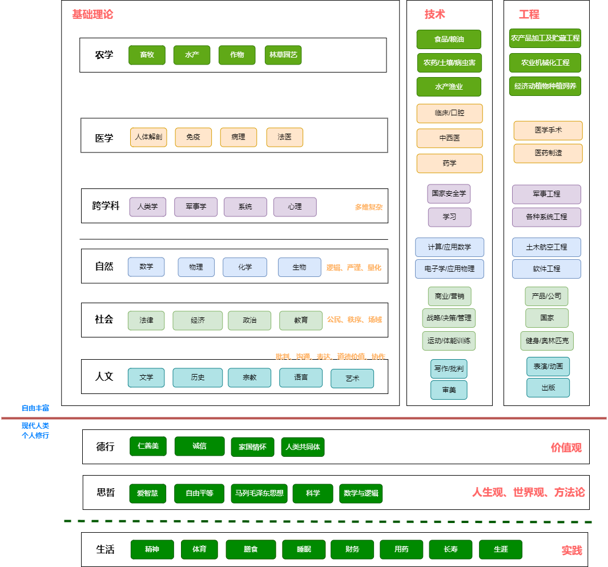

[1959年，他发表著名的“两种文化”演讲 | 历史](http://zhishifenzi.com/depth/thought/2405.html)   
文学家觉得科学家是肤浅的乐观主义者，对文化不了解，而科学家又会觉得文学家的想法太厌世，是病态的，甚至这种厌世和病态是奥斯维辛集中营背后的原因之一。斯诺为两方分别进行了开脱，当然在开脱之余，斯诺批评了整个文学界对于科学的无知，同时也批评了科学家把书仅当作工具，以及对工程的轻视。不管是科学家没读过莎士比亚，还是文学家不懂热力学第二定律，在斯诺的眼里这都是不对的。最后，斯诺将矛头指向了英国的教育系统，认为这一体系过于强调专业化。

新学科的发展，尤其是脑科学（比如，记忆、学习、同理心、情绪等机制）作为桥梁，已拉近了科学（生物、化学）与人文（心理现象）的距离。值得注意的是，在经济转型时期，国家强调科技创新，也许科技能够得到足够的重视，而人文反倒可能被忽视。

面对科技飞速发展带来生活方式的异化，人文可以帮助我们寻找到生活的本质和意义，从这个角度来讲，卢德派的主张倒不失为一个提醒；另一方面，科技的进步，的确如斯诺所言，帮助了穷人提高了生活水平，但却没能解决贫困问题。科技只是提供了可能，但是否一定适用，仍因人而异，与文化密切相关。应用科技来解决贫困问题，其实是个科学之外的问题，这也是斯诺呼吁的科学和人文应更加紧密结合的原因所在。

[从文化视角看科学素养](http://www.xml-data.org/KXYSH/html/87c186b4-6b12-4fd2-ace9-56e2f603de2c.htm)  
科学文化是科学家的创造性活动、成果及凝聚在其中的思想、观念、精神和传统，是在科学与人类其他亚文化系统互动中形成的人类生活方式，并且是一个不断发展的过程。

根据科学文化的第一种意义，科学文化首先是科学家的创造性活动及其成果。因此，对于学习和理解科学来说，理解科学问题、科学发现的背景，理解科学方法和科学发现过程，显然都至关重要，当今我国的科学教育或理科教育则更为侧重知识传授而明显忽视背景、方法和过程，这种倾向不仅偏离科学教育的本质，也对应试教育起了推波助澜的作用。

[Ontology and Epistemology](https://www.webpages.uidaho.edu/engl257/classical/ontology_and_epistemology.htm)

# 知识分类、学科分类
[学科分类与代码:大学科学专业分类图谱|文科/理科/工科|知识](https://www.zhoulujun.cn/html/res/scienceTechnology/Encyclopaedia/8158.html)

[国务院学位委员会第八届学科评议组成员名单](https://ks3-cn-beijing.ksyun.com/attachment/ba328e102c7d46ef27d7c6369b040ec1)  
2020年各学科领军人物。  

[中国科学院大学一级学科学位授予标准](http://www.fjirsm.cas.cn/yjsjy/xwgl/gzzd/202301/W020230116633802644699.pdf)  
每个学科都有介绍和学位标准。  

[中外学科划分情况比较研究](https://ciefr.pku.edu.cn/cbw/kyjb/a8b669e298a54f23971b06b04550d1a5.htm)

[作为“大科学”的人文科学](http://www.aisixiang.com/data/101540.html)  
[马克思主义如何理解“科学”](https://www.jsthinktank.com/zhikuyanjiu/202302/t20230222_7838221.shtml)  
[自然科学、社会科学和人文学科的内涵和外延](https://www.jianshu.com/p/1df84ea6f751)  
人文科学主要研究人本身或与个体精神直接相关的信仰、情感、心态、理想、道德、审美、意义、价值等。  
社会科学以社会作为研究对象，研究人的行为，其目标在于认识各种社会现象并尽可能找出它们的之间的关联。  
自然科学是实验科学或日经验科学，也就是说它是基于经验的。  

[钱学森思维科学思想](https://book.douban.com/subject/10617446/)  

钱老通过运用马哲理论，把科学与马哲进行关联、分类、分层。  

# 科学
[论科学 、技术与工程之间的关系, 2006](http://www.cnki.com.cn/Article/CJFDTOTAL-KXBZ200603005.htm)

[世界观, DeWitt2010](https://book.douban.com/subject/30379527/)  
世界观=核心观点+外围观点。  
由于知觉表征无法确定现实真正的样子，再加上事实可以与当时的整体观点体系拼合在一起，于是想要澄清问题，提供的证据和常识并不是那么的显而易见。  
现代科学并不能保证所有的理论都是正确的，而是提供可能正确的理论。  
经典的亚里斯多德公理化方法=第一原则+三段论。人们普遍认为科学知识必须为真。  
波普的证伪主义=证实证据太难+反复经历明确的预言推敲。  
工具主义=科学理论的主要任务是解释和预言相关数据，而是否反映事物的真实情况不重要。  

[大师说科学与哲学](https://book.douban.com/subject/27041829/)

[具体数学](https://book.douban.com/subject/21323941/)

[哥德尔、艾舍尔、巴赫](https://book.douban.com/subject/1291204/)

[The Principia: Mathematical Principles of Natural Philosophy, isaac1687](https://book.douban.com/subject/1507315/)

https://ocw.mit.edu/courses/science-technology-and-society/sts-003-the-rise-of-modern-science-fall-2010/syllabus/
https://ocw.mit.edu/courses/science-technology-and-society/sts-310-history-of-science-fall-2015/syllabus/
https://books.google.lk/books?id=t4qX37A4PVwC&printsec=frontcover&source=gbs_ge_summary_r&cad=0#v=onepage&q&f=false
https://en.wikipedia.org/wiki/History_of_science
https://en.wikipedia.org/wiki/Branches_of_science

# 历史

[中国历史精神，钱穆1951](https://book.douban.com/subject/10435397/)

> 道=功绩=开物（新技术）成务（新领域）= 立德+立功+立言=人性向“善”  
>  今天的中国缺乏宗教教育 （重塑“道”，党史，国家英雄）

历史=历史本身+历史材料+历史知识  
研究基本方法=观察+记载（自然科学=精密仪器+实验）  
知识越发达，人生相互间的距离越远，竞争越激烈，则人生之痛苦愈深。  
生命=行为+品格≠知识+权力  
民族（道）=历史+文化=为他人打算+普世+有意义   

||中国   | 西方  |总体|
|---|---|---|---|
|教育|道德+人格+文化|教会+国民+个人自由教育 | 家庭+学校+社会，广义，多方面，全人生|
|个人|修身、齐家、治国、平天下 | 个人主义、宗教信仰、科学| 日新其德、自求进步，把自己的事情做到极致、平衡 |
|国家|民族的、发挥人类最高文化 | 独立单位、主权力量|  |
|政府|贤者在位、皇帝+宰相 | 民主议会+无产阶级专政|  |
|制度| 规则+人受法束 | 算法+少数服从多数|  |
|经济| 士农工商，贫而乐，富而好礼 | 中产参政+无产|  |
|文化| 内倾+道 | 外倾+物质的|  |

[中国古代文化常识](https://book.douban.com/subject/26021455/)

[中国历史通论](https://book.douban.com/subject/30457516/)

[中国历代政治得失，钱穆01](https://book.douban.com/subject/1003479/)