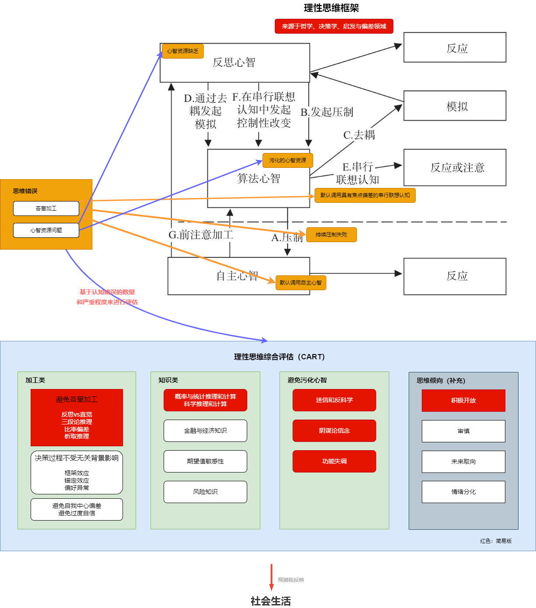
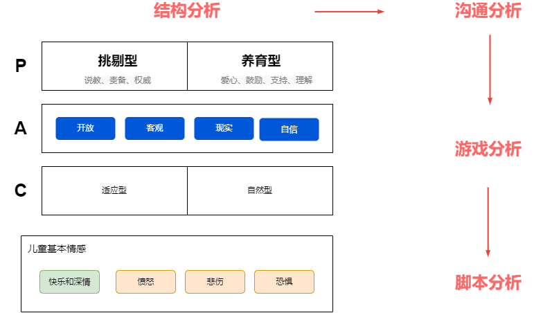

[Nobel02, Kahneman](https://www.nobelprize.org/prizes/economic-sciences/2002/kahneman/facts/)

[mind, thagard05](https://book.douban.com/subject/1869660/)

[Cognition, Brain, & Consciousness, Baars2010](https://book.douban.com/subject/26715572/)  

[what happened to coginitive science, rafael2019](https://www.nature.com/articles/s41562-019-0626-2)

https://plato.stanford.edu/entries/cognitive-science/  
https://www.cs.colorado.edu/~mozer/Teaching/syllabi/3702/  
http://www.cogsci.rpi.edu/public_html/heuveb/teaching/CogSci/Web/Schedule.htm  
https://www.seas.upenn.edu/~cis140/schedule.html  
http://perception.yale.edu/Brian/courses/IntroCogSci-Syllabus.pdf  
http://mechanism.ucsd.edu/teaching/w07/philpsych/bechtel.cogscihistory.pdf  

https://www.open.edu/openlearn/ocw/mod/oucontent/view.php?id=20033&section=1.1

意识？潜意识？理性？感性？

# 决策力

> 选择过多，决策力下降
>
> 比萨和中餐效应
>
> 我们自身的智慧通过情感（精神）和直觉（身体的本能反应）发挥作用

# 思考、推理、解决问题

[Mindware: A Theory of Learnable Intelligence](https://nesslabs.com/mindware)

[超越智商, Stanovich2010](https://book.douban.com/subject/26605978/)  
[理商, Stanovich2016](https://book.douban.com/subject/35083569/)  

本系列书偏学术理论，不太适合科普，但终于把**理商**拉到了独立可测试性的高度。  
对于人们的生活来说，没有什么东西比能够找到“真”和“佳”的思维更实际和更有用的了。  
正是由于流体智力（算法心智）的个体差异或思维倾向（反思心智）的个体差异才导致了不同个体在理性思维和行动中的差异。  
人们常常对自己的选择感到疏离。通俗心理学和专家们所说的“意志力薄弱”也正好体现了这一点。但实际上它反映了人类认知中独有的一个方面，即元表征（metareprentationl）能力。  
人类之所以被称为“认知吝啬鬼”，是因为我们总是趋向于默认一种低耗能的处理方式。  

||工具性理性   | 认知性理性  |
|---|---|---|
|概念| 个人目标实现最优化（**佳**）  | 在信念形成和知识获取过程中的理性行为（**真**）  |
|过程| 个体充分理解并评估各种选择的后果和概率，并在利益最大化的基础上做出决策  | 涉及对信息的评估和筛选，以及对证据的权衡和分析。  |
|结果| 行为与理性决策模型之间存在差异  | 个体识别和纠正潜在的认知偏见、逻辑错误或不合理的推理，以及积极寻求并更新自己的信念和知识  |

[不确定世界的理性选择](https://book.douban.com/subject/25763679/)

[思维与决策](https://book.douban.com/subject/3542657/)

[选择、价值与决策](https://book.douban.com/subject/30172741/)

[学会提问](https://book.douban.com/subject/20428922/)

[逻辑新引·怎样判别是非](https://book.douban.com/subject/30289559/)

[为什么，关于因果关系的新科学](https://book.douban.com/subject/33438811/)

[思维，批判性和创造性思维的跨学科研究]()

[如何独立思考]()

[成功动机与目标]()

[Thinking, the new science of decision-making, problem-solving, and prediction]()

[什么是技术]()

[Simple Heuristics that make us smart]()

# 学习科学

> 学校统一教，孩子个性化的学

[Knowns & unknowns, 96](http://matt.colorado.edu/teaching/highcog/fall8/nbbbbchlpsu96.pdf)  
[Working memory capacity, 2003](http://matt.colorado.edu/teaching/highcog/fall8/cke3.pdf)  
[Metacognition and Cognitive Monitoring, Flavell79](https://pdfs.semanticscholar.org/ee65/2f0f63ed5b0cfe0af4cb4ea76b2ecf790c8d.pdf)  
[perception in chess, simon73](http://matt.colorado.edu/teaching/highcog/fall8/cs73.pdf)  

[为什么学生不喜欢上学，Willingham.D.T.2010](https://book.douban.com/subject/4864832/)  
从认识理论发展的结论分析，承认大脑的各种缺陷是造成大家学习上的各种困难的根源。  
迁移知识、持久练习`使得背景知识演变成中心知识`。 

[聪明在于勤奋，天才在于积累, 华罗庚06](https://book.douban.com/subject/1973934/)  
怎样才算会读书。  
由薄到厚，接受前人成就。先通过分治和发散思维，接受和记忆新知识。增加注释和阅读文献使得书变厚。  
由厚到薄，又能独立思考。再通过聚合和独立思考，去粗取精、去伪存真、由此及彼、由表及里。将全书各部分串联起来理解，弄清主要问题，以及各个问题之间的关联。  
搞科研的态度：开辟方向 > 创造方法 > 模仿、成法解决新问题。  

懂的部分，可以快速略过；要紧的，需要重点专研。对自己来说，一本书新的内容加入到自己的体系中，形成飞轮效应。  

[掌控习惯, clear](https://book.douban.com/subject/34326931/)

我们每天的行动中有40%至50%都出自习惯。  
微习惯=原子习惯=边际收益=1%的改进=长期主义=自我提高的复利    
身份认同控制大方向，体系是过程控制。  
成功的最大威胁不是失败，而是倦怠。  
专业人员依照既定计划行事，毫不动摇；业余爱好者则随波逐流，任性而为。  
**积极性和好奇心**比头脑灵活更重要，因为前者会导致行动。  
满意=喜欢-想要  

https://www.scientificamerican.com/article/how-the-brain-makes-and-breaks-habits/

http://blog.idonethis.com/the-biology-of-productivity/

https://www.healthline.com/health/the-science-of-habit#1

[刻意练习, ericsson2016](https://book.douban.com/subject/26895993/)

[five-stage-model-mental-activities-involved-directed-skill-acquisition, dreyfus80](https://www.researchgate.net/publication/235125013_A_Five-Stage_Model_of_the_Mental_Activities_Involved_in_Directed_Skill_Acquisition)

[make it stick, brow2014](file:///Users/liangge/Desktop/kupdf.net_make-it-stick-the-science-of-successful-learning.pdf)

[thinking fast slow](https://paulminors.com/blog/thinking-fast-slow-book-summary-pdf/)

[learning theories, schunk2011](https://book.douban.com/subject/10579469/?from=tag)

http://matt.colorado.edu/teaching/highcog/fall8/  
https://en.wikipedia.org/wiki/Learning_theory_(education)  

# 心理学

[心理学导论，mitterer07](https://book.douban.com/subject/2125973/)  

[伍尔福克教育心理学, woolfolk2015](https://book.douban.com/subject/26744183/)  

[这才是心理学，2020](https://book.douban.com/subject/35023259/)  

[蛤蟆先生去看心理医生](https://book.douban.com/subject/35143790/)  

基于TA沟通分析心理学的理论，可以看到心理咨询的倾听、共情、沟通技巧，也可以看到一个标准的心理咨询流程的模板 

[社会心理学](https://book.douban.com/subject/1476651/)

