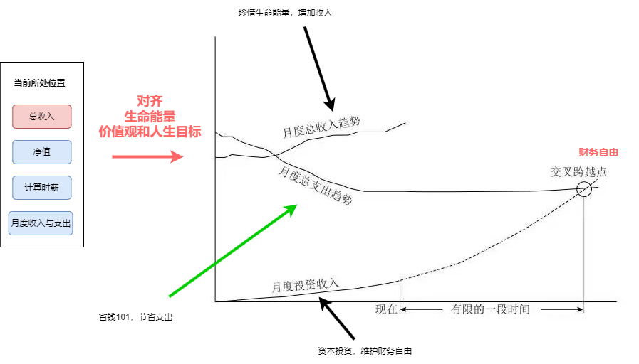

[北大社会学系](http://www.shehui.pku.edu.cn/)

http://sociologyol.ruc.edu.cn/index.htm

# 消费

[当代中国的消费主义现象：消费革命抑或过度消费?](http://sociologyol.ruc.edu.cn/shxyj/fzshx/jjshx/d094964d6e2742d68ef06f2fac261045.htm)

[工作、消费主义和新穷人](https://book.douban.com/subject/35593780/)

[大道至“简”：极简主义消费内涵解构与理论阐释](https://journal.psych.ac.cn/xlkxjz/article/2021/1671-3710/1671-3710-29-11-2043.shtml)

# 财富

[要钱还是要生活](https://book.douban.com/subject/35611477/)

本书第一次提出FIRE生活。这本书并不是一本理财书。它是一份个人发展指南，帮助你厘清自己真正想要的生活，同时训练你改掉可能已经形成的乱花钱的坏习惯。改变人看待钱、挣钱、花钱和攒钱的方式。     

FIRE更像是一连串休假：工作，存钱，投资，辞掉有偿就业去旅行、学习、育儿或进修，几个月或者几年后重新进入有偿就业。  

我们所说的“**财务自由**”是什么意思呢？从最基本的层面上讲，财务自由的意思就是不必再为了钱而工作。不止如此，本书将带你完成解放自我的过程。  

我们已经发现几个**被普遍认同的人类幸福要素**，对每个人都适用。比如，友谊、健康、社群归属、用自己的智慧迎接挑战，以及能掌控生活的感觉等，这些都是幸福感的来源。

我们难道不是在为了工作而扼杀自己，扼杀我们的健康、我们的人际关系、我们的愉悦与好奇心吗？我们在为了钱而牺牲自己的生命，但这个过程很慢很慢，我们几乎毫无察觉。时光流逝的标志唯有苍白的鬓角、**渐粗的腰围**，还有隐隐约约的进步迹象，如高级办公室、公务车或高层职位。最终，我们或许拥有了想要的全部必需用品、有品位的艺术品乃至奢侈品，**但我们已陷入朝九晚五的模式不能自拔**。毕竟，如果我们不工作，时间怎么打发呢？我们曾经想通过就业来寻找意义与成就，这个梦想在职场倾轧、殚精竭虑、无聊沉闷和激烈竞争的现实中逐渐消散。小时候的好奇心、大学时代的使命感、我们与挚友彼此爱惜的岁月都被遗忘——全都付诸“那时我们真年轻”的感叹。  

当我们达到满足感曲线的顶点，说明我们拥有的**足够**了。有足够的必需品供生存，有足够的美好享受带来舒适和愉悦，甚至有足够的小小“奢华”。我们拥有自己需要的一切；没有任何额外的东西让我们心烦意乱、分散精力或苦恼不堪，没有任何东西是我们刷卡购买后一直闲置不用却还在辛辛苦苦为它还账单的。  

我们可以重新给“工作”下定义——凡是我们所做的与人生目标一致的事情都叫“工作”。工作有两个方面：一方面是我们对金钱的需要和渴望，我们工作是为了得到报酬来满足人的基本需求；另一方面与我们的薪资毫不相干——我们工作是为了实现人生中的许多其他积极目标。  

[财富自由，stanley2019](https://book.douban.com/subject/34464026/)  

[小狗钱钱, 舍费尔09](https://book.douban.com/subject/3576486/)

[财富自由之路](https://book.douban.com/subject/27094706/)

[巴菲特致股东的信](https://book.douban.com/subject/30164963/)

[穷查理宝典](https://book.douban.com/subject/4208757/)

[投资者的未来](https://book.douban.com/subject/30313572/)

[穷爸爸、富爸爸](https://book.douban.com/subject/1033778/)

